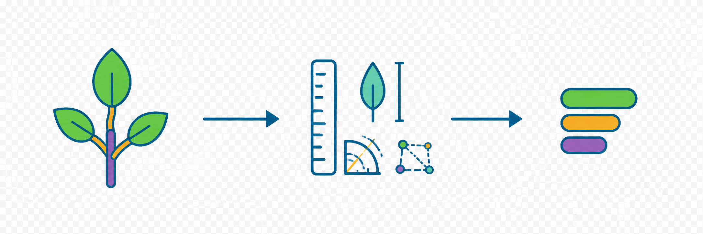
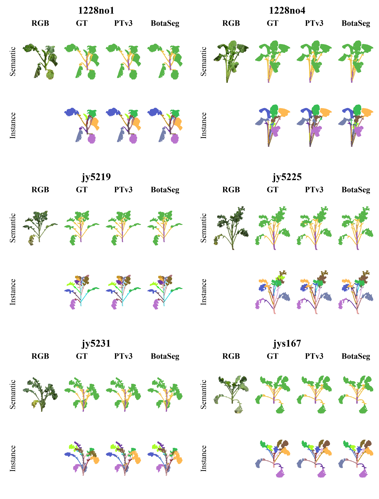
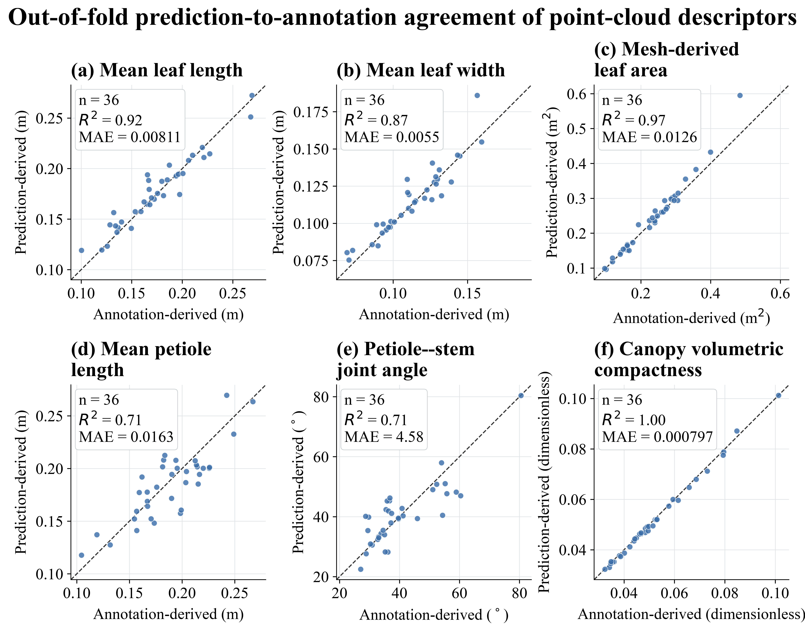

# BotaSeg: organ-resolved 3D phenotyping of rapeseed

This repository contains the code release for **BotaSeg**, the semantic and
instance point-cloud segmentation component of our reconstruction-to-
phenotyping framework for field-grown rapeseed. BotaSeg combines Point
Transformer v3 and SpUNet through geometry-aware fusion, botanical
topology-aware reasoning, and semantic-guided offset regression.

<p align="center">
  
</p>

*From organ-resolved point-cloud parsing to metric-calibrated traits and phenotype fingerprints.*

The accompanying manuscript evaluates the method on 36 manually annotated
rapeseed plants using five held-out-area folds, and on two external plant
point-cloud datasets. The manuscript reports `88.44 ± 1.05%` mIoU and
`71.02 ± 3.46%` mAP on the rapeseed benchmark.

<p align="center">
  
</p>

*Qualitative comparison on six held-out rapeseed plants. BotaSeg is evaluated against PTv3 for semantic and organ-instance parsing.*

<p align="center">
  
</p>

*Out-of-fold agreement between annotation-derived and prediction-derived point-cloud descriptors across 36 plants.*

## Release scope

This repository contains source code, training configurations, data-layout
validation, evaluation utilities, and phenotype-analysis tools. It
deliberately excludes raw images, reconstructed point clouds, annotations,
training logs, prediction dumps, model checkpoints, and the manuscript.
Those materials require separate access and/or archival release.

| Material | Release location |
| --- | --- |
| BotaSeg source, configs, and scripts | This repository |
| Rapeseed annotations and processed point clouds | Dataset archive — link to be added after authorization |
| Pretrained five-fold weights and frozen result tables | Model archive — link to be added after release freeze |
| PLANesT-3D and Archive Plants | Their original providers; this repository supplies only compatible layout guidance |

## Installation

The reference environment is Linux with an NVIDIA GPU, CUDA 11.8, and
PyTorch 2.1. Create the environment, then compile the two CUDA extensions.

```bash
conda env create -f environment.yml
conda activate botaseg

python -m pip install -e libs/pointops
python -m pip install -e libs/pointgroup_ops
```

Point Transformer v3 can use FlashAttention when a compatible build is
available. It is optional: set `enable_flash=False` in a copied configuration
when the local CUDA/PyTorch combination does not support it.

## Data layout and validation

Set `DATA_ROOT` to the separately obtained processed rapeseed dataset. It
must contain `Area_1` through `Area_5`; each plant directory contains
`coord.npy`, `color.npy`, `segment.npy`, and `instance.npy`.

```bash
export DATA_ROOT=/absolute/path/to/myno2paperdatasetpreed
python tools/prepare_data/verify_rapeseed_layout.py --data-root "$DATA_ROOT"
```

See [docs/dataset.md](docs/dataset.md) for array conventions and data-release
requirements. [docs/data-release.md](docs/data-release.md) describes the
recommended Zenodo DOI and Hugging Face mirror strategy.

## Training and evaluation

Run the proposed model in a five-fold protocol:

```bash
export DATA_ROOT=/absolute/path/to/myno2paperdatasetpreed
bash scripts/train_rapeseed_5fold.sh
```

The script writes every output below `exp/`, which is ignored by Git. To
summarize validation logs and optionally sweep clustering parameters:

```bash
EXP_ROOT=exp/myno2paper/insseg-mymethod-v1m1-5fold \
  bash scripts/postprocess_rapeseed_5fold.sh
```

Baseline and ablation configurations are under `configs/myno2paper/`. The
full reproduction protocol, including the mapping from manuscript results to
commands, is in [docs/reproduction.md](docs/reproduction.md).

## Phenotype analysis

`tools/phenotype_demo/` converts segmented instances to organ and plant
traits, generates case-study graphics, and produces phenotype fingerprints.
These tools require point-cloud predictions and metric calibration metadata;
see [docs/reproduction.md](docs/reproduction.md) before applying them to a
new dataset.

## License and attribution

This release retains the MIT license of its Pointcept foundation. See
[LICENSE](LICENSE) and [NOTICE.md](NOTICE.md). Please cite Pointcept and
Point Transformer v3 when using the inherited framework. The BotaSeg paper
citation and archival DOI will be added when the manuscript metadata is
finalized.
